# 🌐 AZ-104 Lab 05 — Implement Intersite Connectivity (Terraform Edition)

This project recreates the Microsoft Learn **AZ-104 Lab 05: Implement Intersite Connectivity** using **Terraform modules**, enabling automated deployment, repeatable infrastructure builds, and clean source control for hybrid connectivity scenarios.

> 📍 Local Path Reference:  
> `C:\Users\shaha\Documents\AZ104-Projects\Projects\Implement-Intersite-Connectivity`

---

## 🚀 Project Modules & Structure

Terraform is modularized across folders:
├── environments/lab/              # Root Terraform environment │   ├── main.tf / variables.tf     # Global wiring and tfvars ├── modules/ │   ├── networking/                # VNet, subnet, peering │   ├── resource-group/            # RG provisioning │   ├── routing/                   # Custom route table logic │   └── virtual-machines/         # VM deployment and SKU validation ├── screenshots/                   # 📸 Portal + TF visuals (see below) └── README.md

---

## 🧠 Lab Tasks Overview

### 🧩 Task 1 — Deploy Core Services VNet & VM

- Core VNet: `CoreServicesVnet` with subnet `Core`
- VM: `CoreServicesVM` deployed with a region-safe SKU selector

**Screenshots:**

- 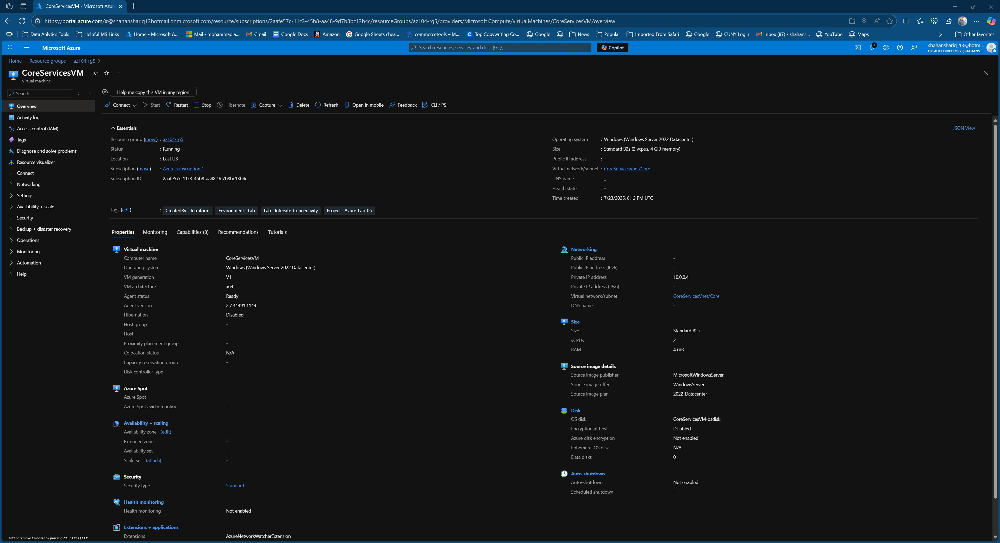
- 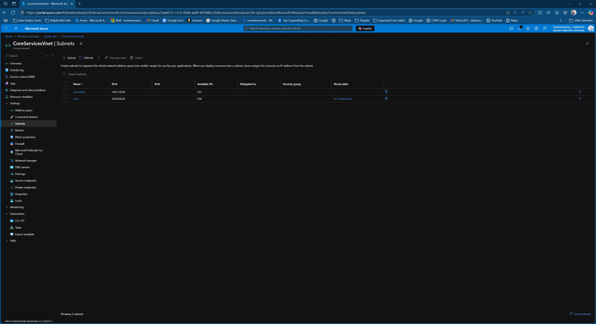
- 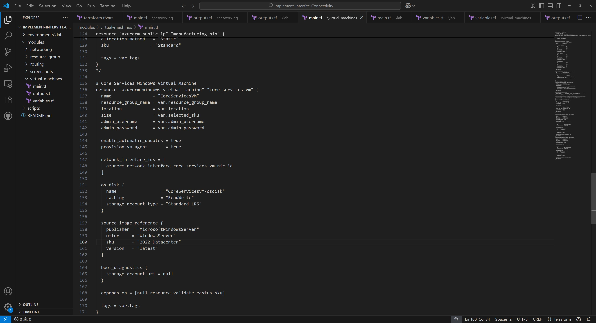
- 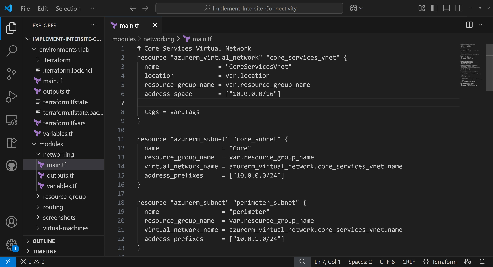

---

### 🏭 Task 2 — Deploy Manufacturing VNet & VM

- Manufacturing VNet: `ManufacturingVnet` with subnet `Manufacturing`
- VM: `ManufacturingVM` deployed in same region

**Screenshots:**

- 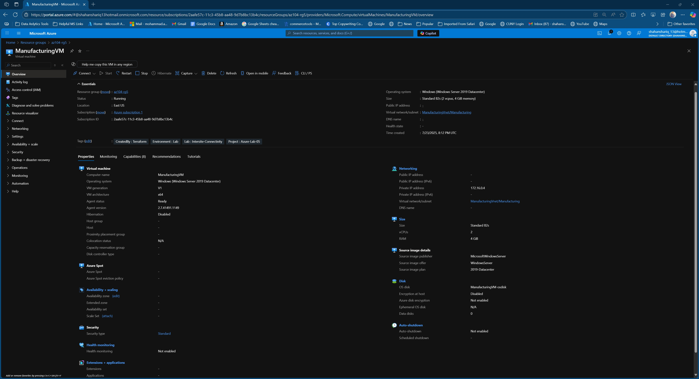
- 
- 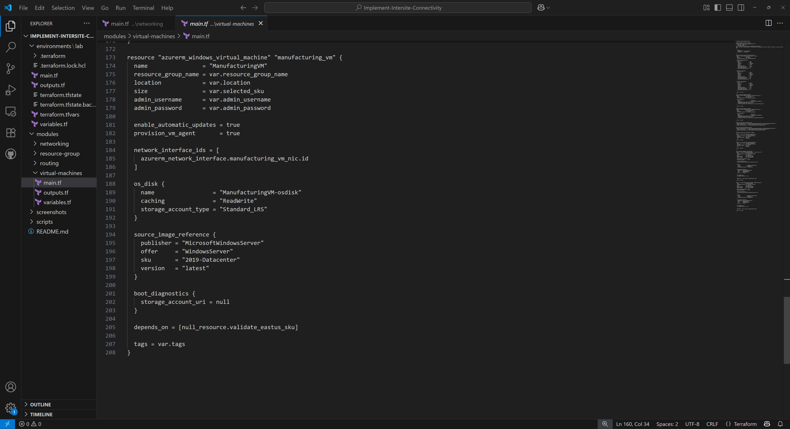
- 

---

### 🔁 Tasks 3 & 4 — Peering & Connectivity Test

Peering created bidirectionally between `CoreServicesVnet` and `ManufacturingVnet`, followed by a successful test using Network Watcher.

> ℹ️ **Note**: Initial unreachable connectivity test was skipped due to Terraform provisioning order. The peering between CoreServicesVnet and ManufacturingVnet had already been applied, so Network Watcher confirmed reachability on first capture.

**Screenshots:**

- 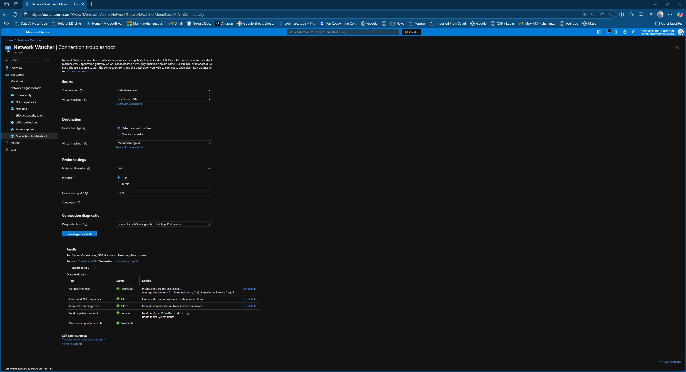
- 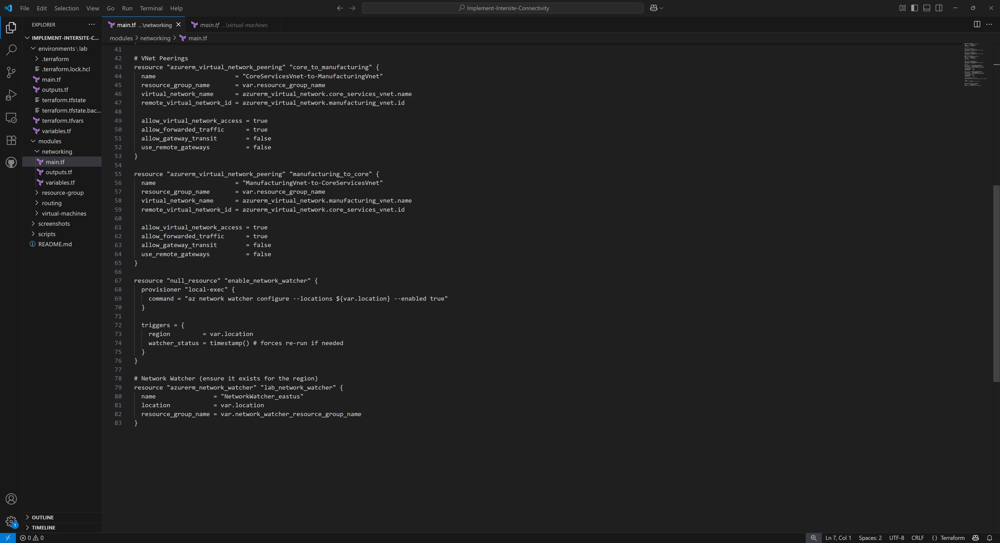

---

### 🧪 Task 5 — Verify VM-to-VM Reachability

Connectivity validated using `Test-NetConnection` via Azure Run Command from `ManufacturingVM`.

**Screenshots:**

- 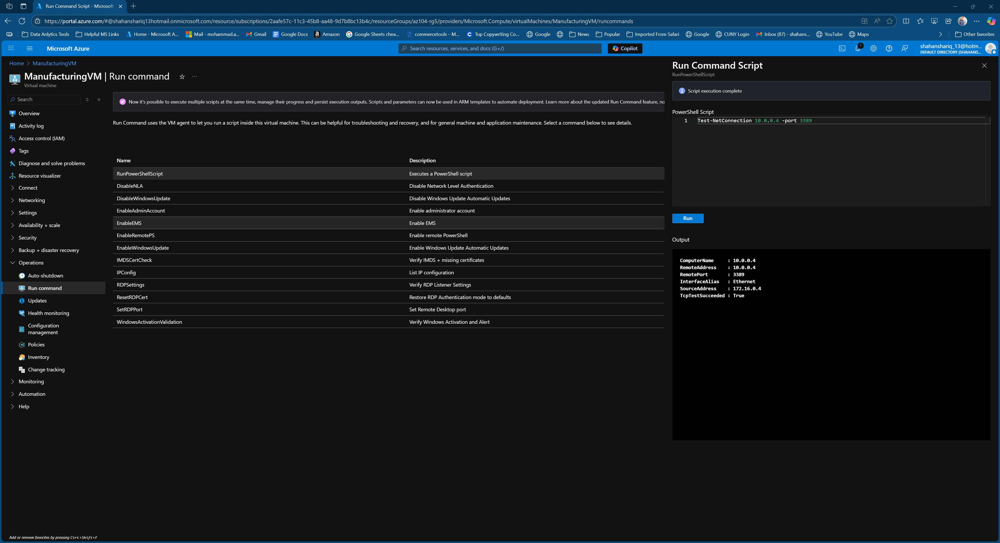
- 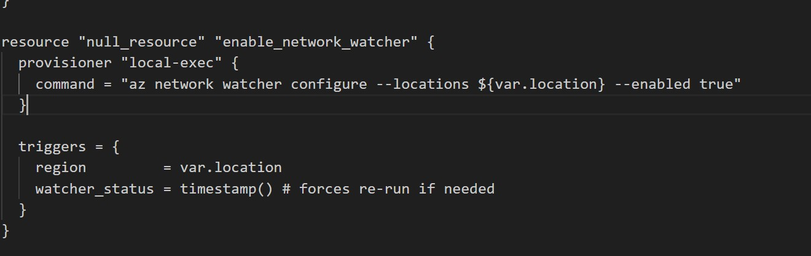

---

### 🛣️ Task 6 — Custom Route Table for Traffic Control

A custom route table named `rt-CoreServices` was created and associated to the `Core` subnet.

**Screenshots:**

- 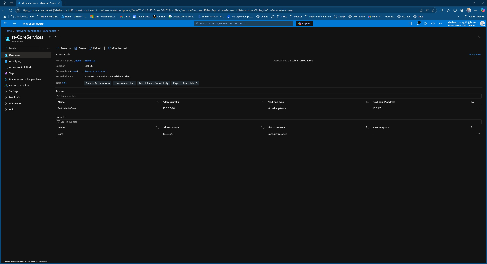
- 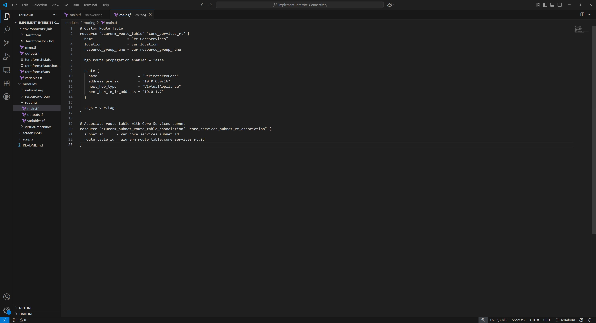
- 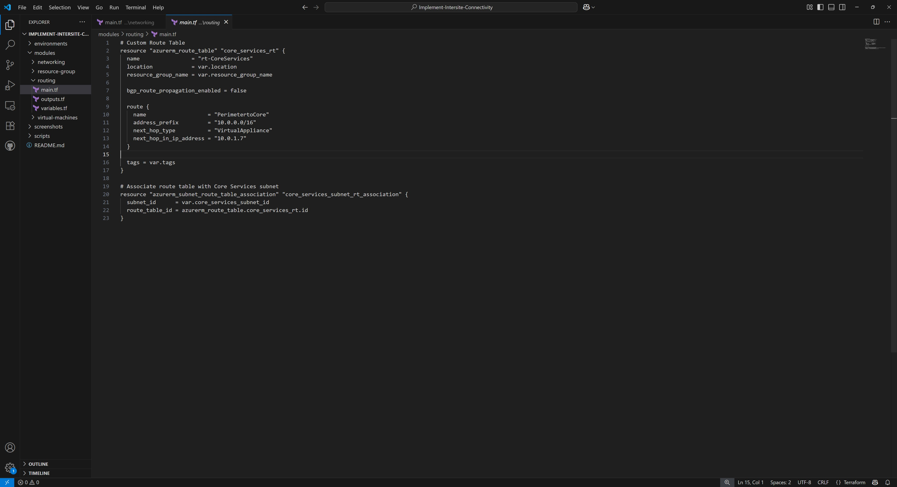

---

## 🔧 Noteworthy Features

- ✅ Region-safe VM sizing with dynamic SKU selector via `variables.tf`
- ⚙️ Modular resource provisioning across `networking`, `routing`, `virtual-machines`
- 🖼️ Screenshots captured post-deployment for validation and documentation
- 🗑️ Clean teardown supported via `terraform destroy` or RG deletion

---

## 📘 Learn More

This project is based on [Microsoft Learn: AZ-104 Lab 05](https://microsoftlearning.github.io/AZ-104-MicrosoftAzureAdministrator/Instructions/Labs/LAB_05-Implement_Intersite_Connectivity.html) — restructured using Infrastructure as Code principles.

